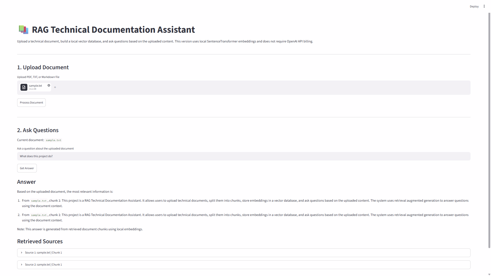

# RAG Technical Documentation Assistant

A local Retrieval-Augmented Generation style documentation assistant that allows users to upload technical documents, split them into chunks, store them in a vector database, and ask questions based on the uploaded content.

This project is designed as a practical introduction to RAG systems, document retrieval, local embeddings, vector search, and source-grounded question answering.

---

## Project Overview

Technical documents, README files, manuals, and project documentation can become long and difficult to search manually.

This project solves that problem by building a simple local documentation assistant.

The user can:

- Upload a PDF, TXT, or Markdown file
- Process the document into smaller chunks
- Generate local embeddings for each chunk
- Store the chunks inside a Chroma vector database
- Ask questions about the uploaded document
- Retrieve the most relevant chunks
- Generate a source-grounded extractive answer
- View the retrieved sources

This version does not require OpenAI API billing. It uses local SentenceTransformer embeddings and generates answers from retrieved document chunks.

---

## What is RAG?

RAG stands for Retrieval-Augmented Generation.

Instead of asking a language model to answer from memory, a RAG system first retrieves relevant context from external documents and then answers based on that context.

Basic RAG workflow:

```text
User Document
   ↓
Document Loading
   ↓
Text Chunking
   ↓
Embedding Generation
   ↓
Vector Database Storage
   ↓
User Question
   ↓
Semantic Search / Retrieval
   ↓
Relevant Chunks
   ↓
Source-Grounded Answer
```

---

## Project Features

- PDF, TXT, and Markdown document upload
- Document loading with LangChain document loaders
- Text chunking with RecursiveCharacterTextSplitter
- Local embedding generation using SentenceTransformers
- Chroma vector database for semantic search
- Retrieval of the most relevant document chunks
- Extractive answer generation from retrieved context
- Source display with file name and chunk ID
- Streamlit user interface
- No OpenAI API billing required for the local version

---

## App Preview

The Streamlit interface allows users to upload a technical document, process it into chunks, build a local vector database, ask questions, and view retrieved sources.



---

## Project Structure

```text
rag-documentation-assistant/
│
├── app/
│   └── streamlit_app.py
│
├── data/
│   ├── documents/
│   └── vectorstore/
│
├── screenshots/
│   └── rag_app_demo.png
│
├── src/
│   ├── __init__.py
│   ├── config.py
│   ├── document_loader.py
│   ├── text_splitter.py
│   ├── vector_store.py
│   └── rag_chain.py
│
├── .env.example
├── .gitignore
├── main.py
├── README.md
└── requirements.txt
```

---

## Architecture

```text
Uploaded Document
       ↓
document_loader.py
       ↓
text_splitter.py
       ↓
vector_store.py
       ↓
Chroma Vector Database
       ↓
User Question
       ↓
Semantic Retrieval
       ↓
rag_chain.py
       ↓
Answer + Retrieved Sources
       ↓
Streamlit UI
```

---

## Technologies Used

- Python
- Streamlit
- LangChain
- LangChain Community
- LangChain Chroma
- LangChain HuggingFace
- ChromaDB
- SentenceTransformers
- HuggingFace Transformers
- PyPDF
- Python-dotenv
- Git
- GitHub

---

## Local Embeddings

This project uses the following local embedding model:

```text
sentence-transformers/all-MiniLM-L6-v2
```

The embedding model converts each document chunk into a numerical vector.

Similar meanings are placed close to each other in vector space. This allows the system to retrieve relevant document chunks even when the user's question does not use the exact same words as the document.

Example:

```text
Question: How do I run the project?
Relevant text: Use streamlit run app/streamlit_app.py
```

Even though the words are different, semantic retrieval can still find the relevant chunk.

---

## How It Works

### 1. Document Upload

Users upload a document through the Streamlit interface.

Supported file types:

```text
.pdf
.txt
.md
```

---

### 2. Document Loading

The project uses LangChain document loaders:

- `PyPDFLoader` for PDF files
- `TextLoader` for TXT and Markdown files

Each loaded document is stored with metadata such as:

```text
source
chunk_id
```

---

### 3. Text Chunking

Documents are split into smaller chunks using:

```text
RecursiveCharacterTextSplitter
```

Default chunk configuration:

```text
CHUNK_SIZE = 1000
CHUNK_OVERLAP = 150
```

Chunking is important because long documents cannot be efficiently searched or passed into a retrieval system as one large block.

---

### 4. Vector Store Creation

Each chunk is embedded using local SentenceTransformer embeddings.

The chunks and their embeddings are stored in:

```text
ChromaDB
```

The vector database is saved locally under:

```text
data/vectorstore/
```

This folder is excluded from GitHub using `.gitignore`.

---

### 5. Semantic Retrieval

When the user asks a question, the system retrieves the most relevant chunks using semantic similarity.

Default retrieval setting:

```text
RETRIEVAL_K = 4
```

This means the system retrieves the top 4 most relevant chunks.

---

### 6. Answer Generation

This version generates an extractive answer from the retrieved chunks.

It does not call an external LLM by default.

The answer includes:

- The most relevant retrieved information
- Source file name
- Chunk ID
- Retrieved source previews

Example output:

```text
Based on the uploaded document, the most relevant information is:

From sample.txt, chunk 1:
This project is a RAG Technical Documentation Assistant...
```

---

## Example Usage

Example document content:

```text
This project is a RAG Technical Documentation Assistant.
It allows users to upload technical documents, split them into chunks, store embeddings in a vector database, and ask questions based on the uploaded content.
The system uses retrieval augmented generation to answer questions using the document context.
```

Example question:

```text
What does this project do?
```

Example answer:

```text
Based on the uploaded document, the most relevant information is:

From sample.txt, chunk 1:
This project is a RAG Technical Documentation Assistant. It allows users to upload technical documents, split them into chunks, store embeddings in a vector database, and ask questions based on the uploaded content.
```

---

## How to Run Locally

### 1. Clone the repository

```bash
git clone https://github.com/Zahra-ziaee/rag-documentation-assistant.git
cd rag-documentation-assistant
```

### 2. Create and activate virtual environment

Windows PowerShell:

```bash
python -m venv .venv
.venv\Scripts\Activate.ps1
```

### 3. Install dependencies

```bash
pip install -r requirements.txt
```

### 4. Run the Streamlit app

Recommended command:

```bash
python -m streamlit run app/streamlit_app.py --server.fileWatcherType none
```

The `--server.fileWatcherType none` option helps avoid unnecessary Streamlit watcher warnings caused by some Transformer-related modules.

---

## Running with a Test File

Create a test file:

```bash
New-Item sample.txt -ItemType File -Force
```

Add this content:

```text
This project is a RAG Technical Documentation Assistant.
It allows users to upload technical documents, split them into chunks, store embeddings in a vector database, and ask questions based on the uploaded content.
The system uses retrieval augmented generation to answer questions using the document context.
```

Then:

1. Open the Streamlit app
2. Upload `sample.txt`
3. Click `Process Document`
4. Ask:

```text
What does this project do?
```

---

## Git Ignore Policy

The following are excluded from GitHub:

```text
.venv/
.env
data/documents/
data/vectorstore/
__pycache__/
*.pyc
```

This prevents local environment files, uploaded documents, API keys, and vector database files from being committed.

---

## Environment Variables

This project includes:

```text
.env.example
```

The `.env.example` file is a template for future environment variables.

The actual `.env` file should not be committed to GitHub.

Current local version does not require an OpenAI API key. However, a future LLM-based version can use:

```text
OPENAI_API_KEY=your_openai_api_key_here
```

---

## Current Status

Completed:

- Project structure
- Streamlit interface
- Document upload
- PDF/TXT/Markdown support
- Document loading
- Text chunking
- Local embedding generation
- Chroma vector store
- Semantic retrieval
- Extractive answer generation
- Retrieved source display
- Local no-cost execution
- App screenshot in README

---

## Limitations

This version does not yet use an LLM for natural language answer generation.

Instead, it returns an extractive answer based on retrieved chunks.

This design was chosen to avoid API billing and make the project fully runnable locally.

Current limitations:

- No LLM-based summarization
- No multi-document chat history
- No advanced reranking
- No LangGraph workflow yet
- No FastAPI backend yet
- No authentication or deployment setup

---

## Future Improvements

Planned improvements:

- Add optional OpenAI or local LLM generation
- Add LangGraph workflow
- Add multi-document support
- Add conversation memory
- Add source citation ranking
- Add PDF page-level citations
- Add FastAPI backend
- Add Docker support
- Add evaluation metrics for retrieval quality
- Add deployment instructions

---

## Key Takeaways

```text
RAG Technical Documentation Assistant | Python, Streamlit, LangChain, ChromaDB, SentenceTransformers

- Built a local RAG-style documentation assistant for uploading and querying technical documents.
- Implemented document loading, text chunking, local embeddings, Chroma vector storage, semantic retrieval, and source-grounded answer generation.
- Used SentenceTransformer embeddings to enable local vector search without OpenAI API billing.
- Built a Streamlit interface for document upload, question answering, and retrieved source display.
```

---

## Author

Zahra Ziaee

Focus: Machine Learning, Data Science, Recommender Systems, MLOps, Forecasting, and Applied AI Systems
